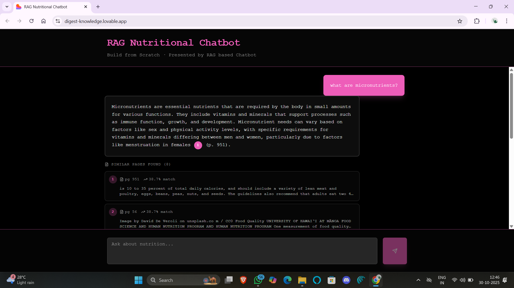

# RAG Nutritional Chatbot

A Retrieval-Augmented Generation (RAG) chatbot built from scratch to answer nutrition-related questions from the textbook *Human Nutrition: 2020 Edition*.

It uses Supabase as the vector database, OpenAI embeddings, and a custom-built Next.js frontend for chat interaction.

---

## Project Overview

This chatbot allows users to ask questions about nutrition.  
It searches through the embedded nutrition textbook, retrieves the most relevant text chunks, and generates responses with cited references.

---

## Frontend Preview

Below are screenshots of the deployed chatbot interface on **Lovable App**:

### 1. Home Interface


### 2. Chat Response Example


### 3. Citation Popup


### 4. Similar Pages Section


---

## Tech Stack

- **Frontend:** Next.js (TypeScript)
- **Backend API:** Next.js route handlers
- **Database:** Supabase (PostgreSQL + pgvector)
- **Embeddings Model:** text-embedding-3-small
- **LLM:** OpenAI GPT models
- **PDF Processing:** PyMuPDF (fitz)
- **Environment Management:** python-dotenv

---


---

## Setup Instructions

### 1. Clone the Repository
```
git clone https://github.com/<your-username>/rag-nutritional-chatbot.git
cd rag-nutritional-chatbot
```

### 2. Set Up Environment Variables

Create a `.env` file in the root directory with:

```
SUPABASE_URL=your_supabase_url
SUPABASE_SERVICE_ROLE_KEY=your_supabase_service_role_key
OPENAI_API_KEY=your_openai_api_key

```

### 3. Create the Supabase Table

Run this SQL in your Supabase SQL Editor:

```
Enable pgvector
create extension if not exists vector;

create table if not exists public.chunks (
id bigserial primary key,
doc_id text not null,
chunk_index int not null,
content text not null,
metadata jsonb default '{}'::jsonb,
embedding vector(1536)
);

create index if not exists idx_chunks_embedding
on public.chunks using ivfflat (embedding vector_cosine_ops)
with (lists = 100);

create or replace function public.match_documents(
query_embedding vector(1536),
match_count int default 5,
filter jsonb default '{}'::jsonb
)
returns table (
id bigint,
doc_id text,
chunk_index int,
content text,
metadata jsonb,
similarity float
)
language plpgsql
stable
as $$
begin
return query
select
c.id,
c.doc_id,
c.chunk_index,
c.content,
c.metadata,
1 - (c.embedding <=> query_embedding) as similarity
from public.chunks c
where (filter = '{}'::jsonb) or (c.metadata @> filter)
order by c.embedding <=> query_embedding
limit match_count;
end;
```
 ## How It Works 
 **1. Ingest Pipeline (`ingest.py`):** 
 - Extracts text from the nutrition PDF.
 - Splits it into semantic chunks.
 - Generates embeddings using OpenAI.
 - Uploads to Supabase (vector store).
**2. Query Pipeline (`route.ts`):**
   - Receives user query.
   - Embeds query text.
   - Fetches top matching chunks from Supabase using `match_documents`.
   - Generates a response citing the retrieved text.
**3. Frontend (`page.tsx`):**
     - Displays a chat interface for nutrition queries.
     - Renders cited sources and similarity scores.
       -- ## Testing the Retrieval
       ``` python test_embeddings.py ```

--- ## Deployment The project is deployed on **Lovable.app**.
--- ## License This project is open-source and available under the MIT License. 
``` **Paste this into your GitHub `README.md` for a clean, professional project intro!**

